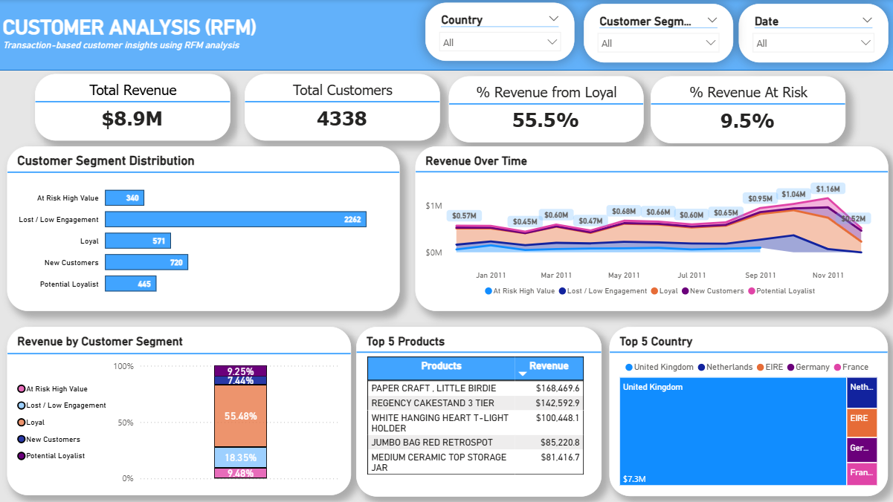

# :shopping_cart: Online Retail Customer Analysis
An end-to-end customer retention analysis project using online retail transaction data, from data cleaning and RFM segmentation to actionable insights and dashboard visualization.

## 👀 Project Overview
This project analyzes online retail transaction data to identify high-priority customer segments and guide retention-focused strategies. The analysis uses RFM-based segmentation to understand customer value concentration, revenue risk, and engagement patterns.

## ❓ Business Question
To keep sales growing, online retailers need to truly understand how their customers shop. But treating every customer exactly the same is a recipe for wasted marketing efforts and lower retention rates. That leaves us with one question:

**“How can transaction data help identify which customers matter most and how they should be retained?”**

## 📂 Project Structure
```text
├── project_da_customer_analysis.py/        → Python script for data cleaning & RFM Analysis
├── Dashboard.pbix/    → Power BI Dashboard
├── Slide Presentation.pdf/   → Project summary and key insights presentation
└── README.md
```

## 📑 Data Source
### - **Public Online Retail Dataset from Kaggle**
Check the full dataset [here](https://www.kaggle.com/datasets/tunguz/online-retail)

### - **Key Variables**
* `InvoiceNo` : transaction identifier
* `CustomerID` : unique customer identifier
* `InvoiceDate` : transaction timestamp
* `Quantity & UnitPrice` : purchase volume and price
* `Description` : product name
* `Country` : customer location

## 📈 Analysis Process
### 1. Data cleaning and preprocessing (Python)

Cleaned the data from:
- **Invalid transaction** -> Dropping 2,517 non-positive value in `Quantity` and `UnitPrice`
- **Missing customer ID** -> 132,220 Transactions with missing `CustomerID` were removed
- **Date formatting** -> The `InvoiceDate` column was converted from string format to datetime format

Feature engineering:
- Created total transaction value by multiplying `Quantity` with `UnitPrice`
- Created reference date that defined as as one day after the latest transaction date

### 2. RFM metric calculation at customer level (Python)

Customer behavior was summarized using transaction-based metrics (RFM) to differentiate customer value and engagement

* **Recency** –> how recently a customer purchased
* **Frequency** –> how often a customer purchased
* **Monetary** –> how much a customer spent

### 3. RFM-based customer segmentation

Customers were grouped into distinct, mutually exclusive segments:
*  Loyal -> High recency, frequency, and monetary value
*  Potential Loyalist -> Active customers with growth potential
*  New Customers -> Recently acquired customers
*  At Risk High Value -> High spenders with declining activity
*  Lost / Low Engagement -> Inactive or low-value customers

### 4. Dashboard (Power BI)

An interactive Power BI Dashboard, provide a high-level view of customer value, risk, and revenue drivers to support retention-focused decisions



## 🔑 Key Insight

### A. Revenue Dependency Is Narrow

Even though data shows a lot of lost customers **(>50%)** of, loyal customer is the no.1 revenue contributor by far amount

**Insight**: It means that increasing customer volume alone is unlikely to significantly improve revenue without shifting customers into higher-value segments

### B. High-Value At Risk Customers Punch Above Their Weight

Although representing only **7.8%** of customers, this segment contributes **9.5%** of total revenue

**Insight**: This justifies focused and customized retention strategies rather than broad campaigns

## 🎯 Business Recommendation

- Prioritize retention efforts on loyal and potential loyal customers to stabilize revenue (e.g. early access to new product)
- Apply targeted and time-sensitive retention for high-value customers showing declining activity to make their comeback (e.g. personalized reactivation email based on the latest purchased)
- Focus retention campaigns on top-performing products and core markets, such as United Kingdom

## 🧰 Tools

- Pyhton (Pandas)
- Power BI

## Contact

- Name: Muhammad Kamil Dipinto
- Email: dipintom3@gmail.com
- Linkedin: linkedin.com/in/muhammadkamildipinto

